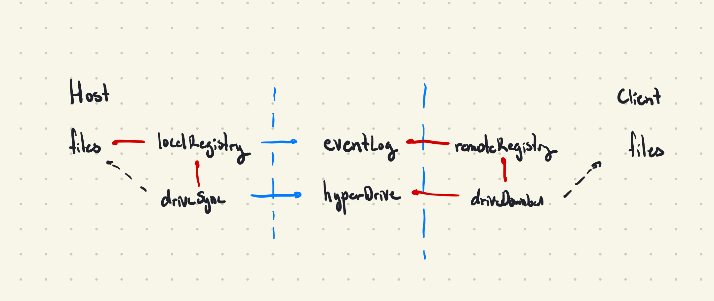

# portal
Peer-to-peer encrypted live folder syncing that respects your `.gitignore`. Not the 2007 video game.

Built on top of the [Hypercore protocol](https://hypercore-protocol.org/) with emphasis on being zero-config, zero-manifest, and decentralized.

## Demos
<p align="center">
  
&nbsp; &nbsp; &nbsp; &nbsp;
  
</p>

## Installation
```shell
# Requires node >=v10.x.x
$ npm install --global portal-sync

# Start using portal
$ portal new

# or 
$ portal join [sessionID]
```

## Highlights
* **Ephemeral**: As soon as you close your `portal`, no further content can be downloaded from it. No data is stored anywhere except on the host device.
* **Decentralized**: There is no central `portal` server that all data is routed through. `portal` only uses public servers to maintain a DHT (distributed hash table) for peer discovery.
* **One-to-many**: A single host can sync data to any number of connected peers.
* **Stream-based**: Utilizes file streaming to handle files of arbitrary size (regardless of whether they fit in memory or not)
* **Efficient**: Changes in single files means that only one file needs to be synced. `portal` tracks which files have changed to avoid resyncing entire folders wherever possible.
* **Secure**: Like Dat, all data is encrypted using the read key. Only those that possess your current 32-byte `portal` session ID can view the data you share.


## Architecture


Portal relies on a publish-subscribe event model to achieve
Trie

## How it works
Think about it like torrents but live
32-byte keys

### How is this different from Dat?
Might seem similar to another similar project built on top of the Hypercore protocol called [Dat](https://github.com/datproject/dat) but there are a few key differences.
1. Dat relies on nodes to keep seeding archives and drives and aims to be a distributed filesystem whereas `portal` focuses purely on being one-to-many for file sharing/syncing.
2. No footprint. Because `portal` is designed to be zero-config, it doesn't leave any dotfiles laying around, whereas Dat stores secrets and metadata in a `~/.dat` folder.
3. Dat tracks version history. Although `portal` runs on the same underlying protocols, I haven't found a need to utilize version histories yet. 